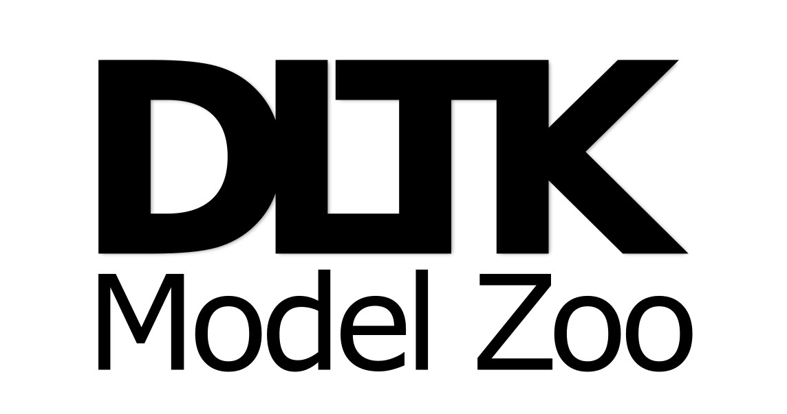

## DLTK Model Zoo
[](https://gitter.im/DLTK/DLTK?utm_source=badge&utm_medium=badge&utm_campaign=pr-badge)
[](https://travis-ci.org/DLTK/models)

 

### Referencing and citing methods in the Model Zoo
To find out how to reference each implementation, please refer to the specifications in the authors' README.md. If you use DLTK in your work please refer to this citation:

```
@article{pawlowski2017state,
  title={DLTK: State of the Art Reference Implementations for Deep Learning on Medical Images},
  author={Nick Pawlowski and S. Ira Ktena, and Matthew C.H. Lee and Bernhard Kainz and Daniel Rueckert and Ben Glocker and Martin Rajchl},
  journal={arXiv preprint arXiv:1711.06853},
  year={2017}
}
```

### Installation
To install DLTK, check out the installation instructions on the main [repo](https://github.com/DLTK/DLTK/blob/master/README.md). Although not encouraged, additional dependecies might need to be installed for each separate model implementation. Please refer to the individual README.md files for further instructions.
Other than that, clone the Model Zoo repository via 

```
git clone https://github.com/DLTK/models.git
```
and download any pre-trained models, if available for download.

### How to contribute
We appreciate any contributions to the DLTK and its Model Zoo. If you have improvements, features or patches, please send us your pull requests! You can find specific instructions on how to issue a PR on github [here](https://help.github.com/articles/about-pull-requests/). Feel free to open an [issue](https://github.com/DLTK/DLTK/issues) if you find a bug or directly come chat with us on our gitter channel [](https://gitter.im/DLTK/DLTK?utm_source=badge&utm_medium=badge&utm_campaign=pr-badge).

#### Basic contribution guidelines
- Python coding style: Like TensorFlow, we loosely adhere to [google coding style](https://google.github.io/styleguide/pyguide.html) and [google docstrings](https://google.github.io/styleguide/pyguide.html#Comments).
- Entirely new features should be committed to ```dltk/contrib``` before we can sensibly integrate it into the core.
- Standalone problem-specific applications or (re-)implementations of published methods should be committed to the [DLTK Model Zoo](https://github.com/DLTK/models) repo and provide a README.md file with author/coder contact information. 
    
### The team
The DLTK Model Zoo is currently maintained by [@pawni](https://github.com/pawni) and [@mrajchl](https://github.com/mrajchl), with greatly appreciated contributions from [@baiwenjia](https://github.com/baiwenjia) [@farrell236](https://github.com/farrell236) (alphabetical order).

### License
See [LICENSE](https://github.com/DLTK/models/blob/master/LICENSE)

### Acknowledgments
We would like to thank [NVIDIA GPU Computing](http://www.nvidia.com/) for providing us with hardware for our research. 
