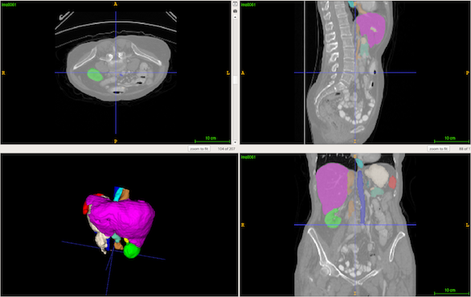

## Abdomninal organ segmentation from 3D CT data



### Contact and referencing this work
If there are any issues please contact the corresponding author of this implementation. If you employ this model in your work, please refer to this citation of the [paper](https://arxiv.org/abs/1711.06853).
```
@article{pawlowski2017dltk,
  title={{DLTK: State of the Art Reference Implementations for Deep Learning on Medical Images}},
  author={Pawlowski, Nick and Ktena, Sofia Ira and Lee, Matthew CH and Kainz, Bernhard and Rueckert, Daniel and Glocker, Ben and Rajchl, Martin},
  journal={arXiv preprint arXiv:1711.06853},
  year={2017}
}
```

### Important Notes
- The original model was trained with DLTK 0.1 which had a slightly different U-Net implementation. We provide the original model and training scripts to closely replicate this.
- We originally trained with `batch_size=8` which requires > 12GB GPU memory. We therefore decreased the batch size of the uploaded script to 4.

### Data
The data can be downloaded after registration from the [challenge website](http://synapse.org/#!Synapse:syn3193805/wiki/217785).

Images and segmentations are read from a csv file in the format below. The original files (*.csv) is provided in this repo. 

These are parsed and extract tf.Tensor examples for training and evaluation in `reader.py` using a [SimpleITK](http://www.simpleitk.org/) for i/o of the .nii files.


### Usage
You can use the code (train.py) to train the model on the data yourself. Alternatively, we provide pretrained models here:
- [original submission based on DLTK 0.1](https://www.doc.ic.ac.uk/~np716/dltk_models/ct_synapse/orig_unet.tar.gz)
- [DLTK 0.2 asymetric U-Net](https://www.doc.ic.ac.uk/~np716/dltk_models/ct_synapse/asym_unet_balce_mom.tar.gz)
- [DLTK 0.2 FCN](https://www.doc.ic.ac.uk/~np716/dltk_models/ct_synapse/fcn_balce.tar.gz)

#### Data Preprocessing

Use `preprocessing.py` for data preprocessing. You should call it as
```
python preprocessing.py -d path/to/training_data -p /path/to/save/processed/data
```
for the training data and
```
python preprocessing.py -d path/to/test_data -p /path/to/save/processed/data -n -s
```
for the test data. This will generate the csv files for training and testing.

#### Training

You can start a basic training with
```
python train.py -c CUDA_DEVICE
```
that will load the file paths from the previously created csvs and saves the model to `/tmp/synapse_ct_seg`. For more settings you can change `config.json`*[]:

#### Deploy

To deploy a model and run inference, run the deploy.py script and point to the model save_path:

  ```
  python deploy.py -p path/to/saved/model -e path/to/save/predictions -c CUDA_DEVICE --csv CSV_WITH_FILES_TO_PREDICT
  ```

Please note, that this implementation imports saved models via [tf.estimator.Estimator.export_savedmodel](https://www.tensorflow.org/api_docs/python/tf/estimator/Estimator#export_savedmodel) and during deploy parses the path to the saved model and not to the save path specified for  [tf.estimator.Estimator.export_savedmodel](https://www.tensorflow.org/api_docs/python/tf/estimator/Estimator#export_savedmodel). For prediction of data without labels use the `-n` flag
