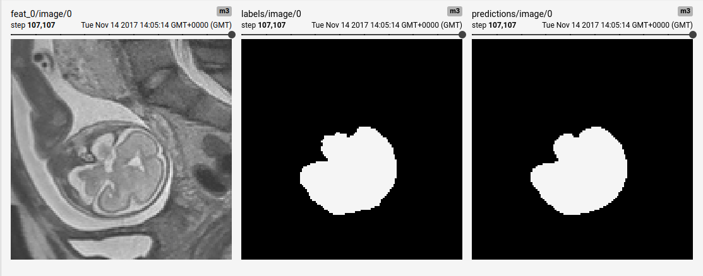

## Fetal brain segmentation from motion corrupted 2D MR image stacks



### Contact and referencing this work
If there are any issues please contact the corresponding author of this implementation. If you employ this model in your work, please refer to this citation of the [paper](https://arxiv.org/abs/1606.01100), which contains more detailed information on the implementation than the original.
```
@article{rajchl2016learning,
  title={Learning under distributed weak supervision},
  author={Rajchl, Martin and Lee, Matthew CH and Schrans, Franklin and Davidson, Alice and Passerat-Palmbach, Jonathan and Tarroni, Giacomo and Alansary, Amir and Oktay, Ozan and Kainz, Bernhard and Rueckert, Daniel},
  journal={arXiv preprint arXiv:1606.01100},
  year={2016}
}
```

### Important Notes
This is a close implementation of the original caffe code, however differs from that described in the paper in the following points:
- The model was trained on [None, 3, 128, 128, 1] slices, rather than the original code encoding the adjacent slices as channels (i.e. [None, 1, 128, 128, 3])
- Batch normalisation was employed before each ReLu non-linearity

### Data
The MR images have been collected during the [iFind (intellient Fetal Imaging and Diagnosis) project](http://www.ifindproject.com/) at King's College London. For this experimental setup, the model was trained on 30 volumes and validated on 7. If you would require access to image data, please contact the [iFind MRI team](http://www.ifindproject.com/team-2/). 

Images and segmentations are read from a csv file in the format below. The original file (iFind_fetal.csv) is provided in this repo. 

iFind_fetal.csv:
```
iFIND_id,image,segmentation
iFIND00011,/vol/biomedic2/mrajchl/data/iFind2_db/imgs/iFIND00011.nii.gz,/vol/biomedic2/mrajchl/data/iFind2_db/seg/iFIND00011.nii.gz
iFIND00018,/vol/biomedic2/mrajchl/data/iFind2_db/imgs/iFIND00018.nii.gz,/vol/biomedic2/mrajchl/data/iFind2_db/seg/iFIND00018.nii.gz
...
```

These are parsed and extract tf.Tensor examples for training and evaluation in `reader.py` using a [SimpleITK](http://www.simpleitk.org/) for i/o of the .nii files.


### Usage
- You can download a pre-trained model for fine-tuning or deployment [here](https://www.doc.ic.ac.uk/~mrajchl/dltk_models/model_zoo/fetal_brain_segmentation_mri.tar.gz). 
The archive contains both the tf.estimator export folder and the standard 
.index, .meta and .data-* files for continuing training. Extract the model 
folder from the .tar.gz file and point your ```--model_path``` MY_MODEL_PATH 
argument to its location (see below). 

- To train a new model, run the train.py script. Display run options with
  ``` python train.py --help ```:  

  ```
  usage: train.py [-h] [--run_validation RUN_VALIDATION] [--restart] [--verbose]
                    [--cuda_devices CUDA_DEVICES] [--model_path MODEL_PATH]
                    [--data_csv DATA_CSV]  
  ``` 
  
  To start training, run the training script with the desired options:  

  ```
  python train.py MY_OPTIONS
  ```

  The model and training events will be saved to a ```model_path``` 
  MY_MODEL_PATH

- For monitoring and metric tracking, spawn a tensorboard webserver and point
 the log directory to MY_MODEL_PATH:

  ```
  tensorboard --logdir MY_MODEL_PATH
  ```
  
  
  

- To deploy a model and run inference, run the deploy.py script and point to 
the trained model:

  ```
  python -u deploy.py --model_path MY_MODEL_PATH
  ```
  
  Note that during deploy we average the predictions of 4 random crops of a test input, so results may vary a bit from run to run. The expected output of deploy should look similar to the one below and yield a test Dice of approximately 0.924 +/- 0.022:
  
  ```
    Loading from .../1511556748
    Dice=0.94843941927; input_dim=(1, 120, 336, 336, 1); time=17.9820091724; output_fn=.../iFIND00031.nii.gz;
    Dice=0.951662540436; input_dim=(1, 170, 336, 336, 1); time=22.7679200172; output_fn=.../iFIND00035.nii.gz;
    ...
  ```
  
