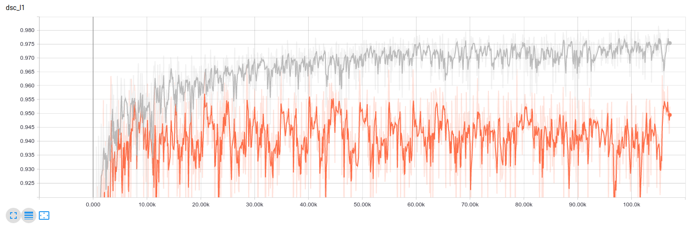

## Fetal brain segmentation from motion corrupted 2D MR image stacks


### Contact and referencing this work
If there are any issues please contact the corresponding author of this implementation. If you employ this model in your work, please refer to this citation of the [paper](https://arxiv.org/abs/1606.01100), which contains more detailed information on the implementation than the original.
```
@article{rajchl2016learning,
  title={Learning under distributed weak supervision},
  author={Rajchl, Martin and Lee, Matthew CH and Schrans, Franklin and Davidson, Alice and Passerat-Palmbach, Jonathan and Tarroni, Giacomo and Alansary, Amir and Oktay, Ozan and Kainz, Bernhard and Rueckert, Daniel},
  journal={arXiv preprint arXiv:1606.01100},
  year={2016}
}
```

### Important Notes
This is a close implementation of the original caffe code, however differs from that described in the paper in the following points:
- The model was trained on [None, 3, 128, 128, 1] slices, rather than the original code encoding the adjacent slices as channels (i.e. [None, 1, 128, 128, 3])
- Batch normalisation was employed before each ReLu non-linearity

### Data
The MR images have been collected during the [iFind (intellient Fetal Imaging and Diagnosis) project](http://www.ifindproject.com/) at King's College London. For this experimental setup, the model was trained on 30 volumes and validated on 7. If you would require access to image data, please contact the [iFind MRI team](http://www.ifindproject.com/team-2/). 

Images and segmentations are read from a csv file in the format below. The original file (iFind_fetal.csv) is provided in this repo. 

iFind_fetal.csv:
```
iFIND_id,image,segmentation
iFIND00011,/vol/biomedic2/mrajchl/data/iFind2_db/imgs/iFIND00011.nii.gz,/vol/biomedic2/mrajchl/data/iFind2_db/seg/iFIND00011.nii.gz
iFIND00018,/vol/biomedic2/mrajchl/data/iFind2_db/imgs/iFIND00018.nii.gz,/vol/biomedic2/mrajchl/data/iFind2_db/seg/iFIND00018.nii.gz
...
```

These are parsed and extract tf.Tensor examples for training and evaluation in `reader.py` using a [SimpleITK](http://www.simpleitk.org/) for i/o of the .nii files:


### Training


To train a new model, run the train.py script:

  ```
  python -u train.py MY_OPTIONS
  ```

### Monitoring

For monitoring and metric tracking, spawn a tensorboard webserver and point the log directory to the model save_path:

  ```
  tensorboard --logdir /tmp/fetal_brain_segmentation/

  ```
  
### Deploy

To deploy a model and run inference, run the deploy.py script and point to the model save_path:

  ```
  python -u deploy.py --save_path /tmp/mrbrains_segmentation/ MY_OPTIONS
  ```

Please note, that this implementation imports saved models via [tf.estimator.Estimator.export_savedmodel](https://www.tensorflow.org/api_docs/python/tf/estimator/Estimator#export_savedmodel) and during deploy parses the model_path for a subfolder containing such data. 
