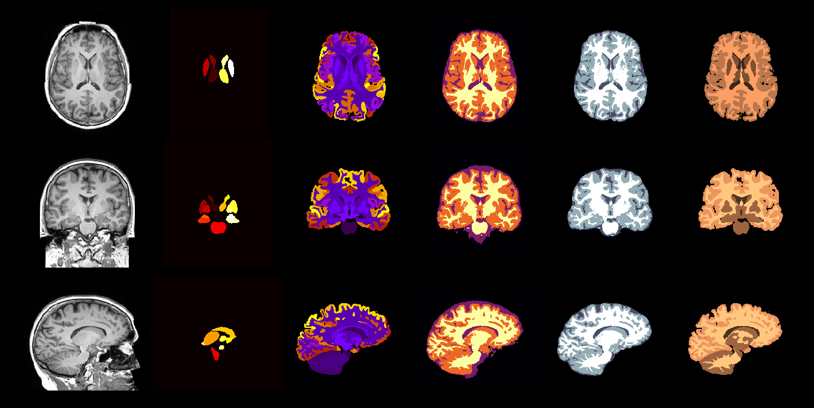

## Fast and Robust Reproduction of Multiple Brain Image Segmentation Pipelines



### Contact and referencing this work
If there are any issues please contact the corresponding author of this implementation. If you employ this model in your work, please refer to this citation of the [paper](https://openreview.net/pdf?id=Hks1TRisM).
```
@inproceedings{rajchl2018neuronet,
  title={NeuroNet: Fast and Robust Reproduction of Multiple Brain Image Segmentation Pipelines},
  author={Martin Rajchl and Nick Pawlowski and Daniel Rueckert and Paul M. Matthews and Ben Glocker},
 booktitle={International conference on Medical Imaging with Deep Learning (MIDL)},
  pages={},
  year={2018}
}
```


### Data
The data can be downloaded after registration from the [UK Biobank Imaging Enhancement Study website](https://imaging.ukbiobank.ac.uk/).

Images and segmentations are read from a csv file in the format below. The original files (*.csv) is provided in this repo. 

These are parsed and extract tf.Tensor examples for training and evaluation in `reader.py` using a [SimpleITK](http://www.simpleitk.org/) for i/o of the .nii files.


### Usage
Files:
- `parse_csvs.ipynb` creates training/validation/testing .csv files from data paths and splits the subject ids into categories.
- `sandbox.ipynb` visually assesses the outputs of the `reader.py` for a visual check of the inputs
- `eval.ipynb` computes the visual and numerical results for the paper

- `reader.py` dltk reader, containing the label mappings to and from consecutive ids and the python generator creating input tensors to the network, using a SimpleITK interface 
- `train.py` main training script to run all experiments with
- `deploy.py` generic deploy script for all experiments

- `config*.json` are configuration files to determine the dataset(s) to train on, scaling the flexible NeuroNet architecture and a few exposed training parameters.
- `*.csv` csv files generated with `parse_csvs.ipynb`, containing the paths to all .nii image files


#### Data Preprocessing
We did not apply any data preprocessing, such as brain stripping or additional bias correction, etc. The input to the network is a single MNI registered 1mm isotropic T1-weighted MR image (as procude by the UK Biobank). Please refer to the [UKB Neuroimaging documentation](https://biobank.ctsu.ox.ac.uk/crystal/docs/brain_mri.pdf) for additional information. 

#### Training
You can use the code (train.py) to train the model on the data yourself. Alternatively, we provide pretrained models from the paper here:
- [neuronet_all](http://www.doc.ic.ac.uk/~mrajchl/dltk_models/model_zoo/neuronet/neuronet_all.tar.gz)
- [neuronet_tissue](http://www.doc.ic.ac.uk/~mrajchl/dltk_models/model_zoo/neuronet/neuronet_tissue.tar.gz)
- [neuronet_single fsl fast](http://www.doc.ic.ac.uk/~mrajchl/dltk_models/model_zoo/neuronet/fsl_fast.tar.gz)
- [neuronet_single fsl first](http://www.doc.ic.ac.uk/~mrajchl/dltk_models/model_zoo/neuronet/fsl_first.tar.gz)
- [neuronet_single spm tissue](http://www.doc.ic.ac.uk/~mrajchl/dltk_models/model_zoo/neuronet/spm_tissue.tar.gz)
- [neuronet_single malp_em tissue](http://www.doc.ic.ac.uk/~mrajchl/dltk_models/model_zoo/neuronet/malp_em_tissue.tar.gz)
- [neuronet_single malp_em](http://www.doc.ic.ac.uk/~mrajchl/dltk_models/model_zoo/neuronet/malp_em.tar.gz)


Depending on the model, the number of output volumes will correspond with the number of segmentation tasks (i.e. neuronet_single will produce one volume, neuronet_all will produce 5 segmentation volumes).

You can start a basic training with
```
python train.py -c CUDA_DEVICE --config MY_CONFIG
```
that will load the file paths from the previously created csvs, according to the config parameters. 

#### Deploy
To deploy a model and run inference, run the deploy.py script and point to the model save_path:

  ```
  python deploy.py -p path/to/saved/model -c CUDA_DEVICE --config MY_CONFIG
  ```

Please note, that this implementation imports saved models via [tf.estimator.Estimator.export_savedmodel](https://www.tensorflow.org/api_docs/python/tf/estimator/Estimator#export_savedmodel) and during deploy parses the path to the saved model and not to the save path specified for  [tf.estimator.Estimator.export_savedmodel](https://www.tensorflow.org/api_docs/python/tf/estimator/Estimator#export_savedmodel). For prediction of data without labels use the `-n` flag
